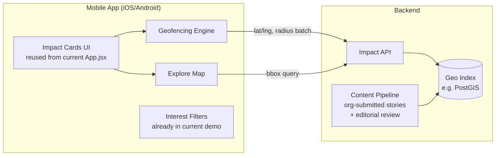

# LocalImpact — Phone App Design

## 1. The idea in one sentence

Walk down a street, and your phone quietly tells you: *"The park you're passing, the water you drink, the air you're breathing — a nonprofit fought for that. Here's who, and what they did."*

Today's repo (`src/App.jsx`) proves the content model with a **search-by-zip-code web demo**. This document designs the next step: a **location-aware mobile app** that surfaces the same content proactively, triggered by where you physically are, instead of requiring you to search for it.

## 2. What changes vs. the current demo

| | Current demo | Phone app |
|---|---|---|
| Trigger | User picks a zip code from a list/search box | App detects you're near a place with a story and notifies you |
| Geography | Zip code (5-digit, ~10 known codes) | Lat/lng points + radius ("impact points"), works anywhere data exists |
| Delivery | Open the page, browse tabs | Push notification / lock-screen alert, opened when relevant |
| Data | Hardcoded `LOCATION_DATA` object in `App.jsx` | Same content model, served from an API, addressable by geo-coordinate |
| Org model | `ORGS` dict, "delivered / in progress / involved" per zip | Unchanged — this is the strongest part of the current design and should carry over as-is |

The categories (`env_health`, `climate`, `land`, `justice`), the `delivered / inProgress / involved` framing, the `orgId` attribution, and the two-skin branding (civic vs. org-branded like Sierra Club) are all good abstractions already. Keep them.

## 3. Core experience

**Ambient mode (the headline feature).** The app runs in the background with coarse location permission. When you enter the radius of an "impact point" — a specific place tied to a story ("this stretch of the Hudson," "this park," "this water system") — you get a notification:

> 🌿 **Sierra Club** protected this stretch of Riverside Park from development.
> Tap to see what happened.

Tapping opens the same `delivered`/`inProgress`/`involved` card layout the demo already has.

**Explore mode (pull, not push).** A map view (not present in the current demo) showing pins for every impact point near you or in an area you're browsing, color-coded by category using the existing category palette. Useful for tourists, dog walkers, or anyone who wants to browse without waiting for an alert.

**Radar/nearby list.** A simple list ranked by distance — the mobile equivalent of the current zip search, for when GPS is imprecise or the user wants a manual index.

**Digest mode.** For users who don't want push interruptions: a weekly "Here's what happened near you" summary notification instead of real-time alerts. This should be the default, with real-time opt-in — see privacy section.

## 4. Data model changes

The current `LOCATION_DATA` is keyed by zip code with a flat list of stories per zip. For geofencing, each story needs to become (or gain) a **point**, not just a zip-level bucket:

```js
{
  id: "riverside-park-89th",
  coords: { lat: 40.7889, lng: -73.9776 },
  radiusMeters: 150,
  neighborhood: "Upper West Side",
  zip: "10024",              // keep for search/fallback
  category: "land",
  orgId: "riverside_park",
  status: "delivered",        // delivered | inProgress | involved
  summary: "...",
  issue: "...", why: "...", done: "...", outcome: "...",
  bulletLink: "...", bulletLinkLabel: "..."
}
```

This is additive — every field from the current story objects (`summary`, `issue`, `why`, `done`, `outcome`, `bulletLink`, `group`, `category`, `orgId`) is preserved. The only new fields are `coords` and `radiusMeters`. Zip-level stories without a precise address can ship with the zip's centroid and a larger radius (e.g. 800m) as a fallback — so nothing in the existing content needs to be thrown away to launch geofencing.

`ORGS` carries over unchanged as the org-attribution layer.

## 5. Architecture



**Client:** React Native (Expo) is the pragmatic choice — it lets you reuse a large share of the existing React component logic (`App.jsx`'s card rendering, skin/category theming, tab structure) almost as-is, swapping web DOM elements for RN primitives. A second option is a PWA with the Geolocation `watchPosition` API, which ships faster but can't do reliable background geofencing on iOS (Safari kills background JS). For the "alerted while walking" feature to actually work, native geofencing APIs (iOS `CLCircularRegion` / Android `Geofencing API`) are required — that's the deciding factor for going native/Expo over PWA.

**Backend:** A geo-indexed API (PostGIS `ST_DWithin`, or a simpler approach like geohash bucketing if starting small) that answers two query shapes: "what impact points are within N meters of this coordinate" (for alerts) and "what impact points are within this bounding box" (for the map). This can start as a thin wrapper that just serves the existing hardcoded content as JSON — no need to stand up a database on day one.

**Content pipeline:** The current data is hand-written per zip code. At any real scale this needs an intake process — nonprofits or a small editorial team submit stories with a place, category, and citations, which get reviewed before publishing (to keep the "org gets credit" model honest and avoid unverified claims).

## 6. Geofencing design specifics

- Register a **bounded number of active regions** (iOS caps at 20 concurrent monitored regions per app) around the user's current area, refreshed as they move — not one region per impact point globally.
- Batch registration: on app open or significant location change, fetch impact points within ~2km, register geofences for the nearest 20, and re-register as the user moves out of that cluster.
- Debounce: don't re-alert for a point already shown in the last N days.
- Respect "significant location change" APIs for battery — full GPS tracking is not needed for a feature that fires maybe a few times a day.

## 7. Privacy & permissions

- **Default to "When In Use" + digest mode**, not always-on background alerts — ask for background/"Always" location only after the user has seen value from the app once.
- Never transmit precise continuous location to a server; do geofence matching from a locally cached set of nearby points where possible, syncing only coarse position (e.g., current city/zip) to fetch that set.
- Make it trivial to mute a category or org (interest filters already exist in the demo — carry them over as alert filters, not just display filters).
- No location history retention beyond what's needed to prefetch the local point cache.

## 8. Reuse plan from this repo

Nothing here requires discarding `src/App.jsx`:
- `ORGS`, category definitions, and skin theming → reused verbatim as the content/branding layer.
- Story fields (`summary/issue/why/done/outcome/bulletLink`) → reused verbatim as the card schema.
- `LOCATION_DATA` → becomes the seed data for the geo-indexed backend; zip-level entries get centroid coordinates as an interim step before per-story precise coordinates are added.
- Tab structure (`delivered/inProgress/involved`) → becomes the detail screen when a notification is tapped.

## 9. Suggested phasing

1. **Phase 0 (current state):** Web demo, manual zip search. Done.
2. **Phase 1:** Add `coords`/`radiusMeters` to existing story data (using zip centroids), stand up a thin geo-query API in front of the same JSON content, add a map/"explore nearby" view to the existing web app — no native app yet, no push.
3. **Phase 2:** Expo app wrapping the same UI components, request location permission, implement foreground-only "nearby now" list (no background geofencing yet) to validate the UX before investing in native alert infrastructure.
4. **Phase 3:** Background geofencing + push notifications, digest mode, per-category/org mute controls.
5. **Phase 4:** Content pipeline for nonprofits to submit their own impact points for editorial review, scaling coverage beyond hand-curated Sierra Club data.

## 10. Open questions

- **Verification standard:** what bar does a "we did this" claim need to meet before it's shown to a stranger on the street? (The current data already models this well with `bulletLink` citations — worth formalizing into an editorial checklist.)
- **Multi-org overlap:** when several orgs claim credit for the same outcome (already visible in the Storm King / Everglades Coalition entries), how does the UI represent shared credit without diluting any one org's story?
- **Monetization:** nonprofit-sponsored placement (an org pays to have its verified stories prioritized in its home regions) is the most obvious non-ad model, consistent with the existing "skin" concept (civic vs. Sierra Club-branded).
